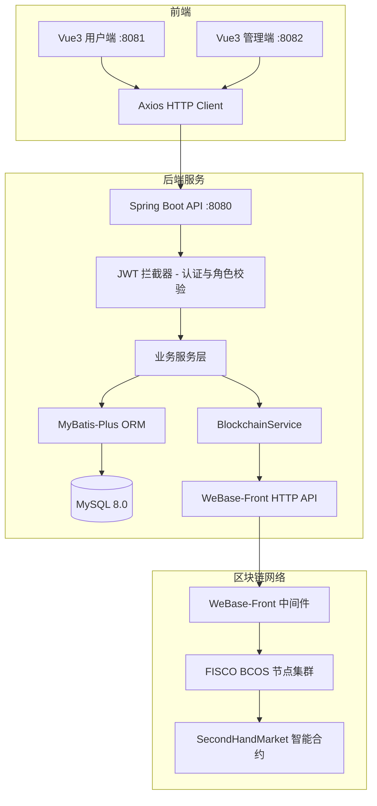
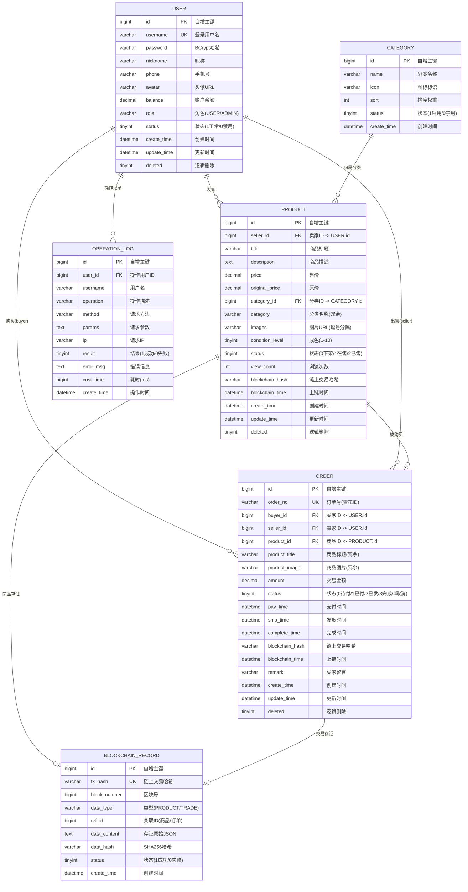

# 区块链二手买卖平台 - 项目设计文档

## 1. 系统架构



## 2. ER 图



## 3. 接口清单

### 3.1 用户模块 (UserController)

| 方法 | 路径 | 认证 | 描述 |
|------|------|------|------|
| POST | /api/user/register | 否 | 用户注册 |
| POST | /api/user/login | 否 | 用户登录，返回JWT(含role) |
| GET | /api/user/info | 是 | 获取当前用户信息 |
| PUT | /api/user/update | 是 | 更新用户信息 |

### 3.2 商品模块 (ProductController)

| 方法 | 路径 | 认证 | 描述 |
|------|------|------|------|
| POST | /api/product/publish | 是 | 发布商品（自动上链存证） |
| GET | /api/product/list | 否 | 商品列表（分页、搜索、分类筛选） |
| GET | /api/product/{id} | 可选 | 商品详情（有token解析用户，无token也可访问） |
| GET | /api/product/my | 是 | 我发布的商品 |
| PUT | /api/product/{id} | 是 | 更新商品（仅卖家） |
| DELETE | /api/product/{id} | 是 | 下架商品（仅卖家） |
| GET | /api/product/verify/{id} | 否 | 验证商品链上数据完整性 |

### 3.3 订单模块 (OrderController)

| 方法 | 路径 | 认证 | 描述 |
|------|------|------|------|
| POST | /api/order/create | 是 | 创建订单 |
| GET | /api/order/list | 是 | 订单列表（支持买/卖筛选、状态筛选） |
| GET | /api/order/{id} | 是 | 订单详情 |
| PUT | /api/order/{id}/pay | 是 | 支付订单（扣买家余额） |
| PUT | /api/order/{id}/ship | 是 | 发货（仅卖家） |
| PUT | /api/order/{id}/confirm | 是 | 确认收货（加卖家余额，自动上链存证） |
| PUT | /api/order/{id}/cancel | 是 | 取消订单（仅待支付状态） |
| GET | /api/order/verify/{id} | 否 | 验证交易链上数据完整性 |

### 3.4 区块链模块 (BlockchainController)

| 方法 | 路径 | 认证 | 描述 |
|------|------|------|------|
| GET | /api/blockchain/record/{txHash} | 否 | 按交易哈希查询存证记录 |
| GET | /api/blockchain/records | 否 | 存证记录列表（分页） |

### 3.5 管理后台模块 (AdminController)

| 方法 | 路径 | 认证 | 角色 | 描述 |
|------|------|------|------|------|
| GET | /api/admin/stats | 是 | ADMIN | 统计数据（用户/商品/订单/存证数量） |
| GET | /api/admin/users | 是 | ADMIN | 用户列表（分页、搜索） |
| PUT | /api/admin/users/{id}/status | 是 | ADMIN | 启用/禁用用户 |
| GET | /api/admin/categories | 是 | ADMIN | 分类列表 |
| POST | /api/admin/categories | 是 | ADMIN | 新增分类 |
| PUT | /api/admin/categories/{id} | 是 | ADMIN | 更新分类 |
| DELETE | /api/admin/categories/{id} | 是 | ADMIN | 删除分类 |
| GET | /api/admin/products | 是 | ADMIN | 商品列表（分页、搜索） |
| PUT | /api/admin/products/{id}/status | 是 | ADMIN | 更新商品状态 |
| DELETE | /api/admin/products/{id} | 是 | ADMIN | 删除商品 |
| GET | /api/admin/orders | 是 | ADMIN | 订单列表（分页、搜索） |
| GET | /api/admin/logs | 是 | ADMIN | 操作日志列表（分页、搜索） |


## 4. 认证与权限设计

### 4.1 JWT Token 结构

```json
{
  "userId": 1,
  "username": "admin",
  "role": "ADMIN",
  "sub": "admin",
  "iat": 1707264000,
  "exp": 1707350400
}
```

### 4.2 权限控制流程

1. 用户登录 → 后端生成含 `role` 字段的 JWT
2. 前端请求携带 `Authorization: Bearer <token>`
3. `JwtInterceptor` 解析 token，将 userId/username/role 存入 `UserContext`
4. `/api/admin/*` 路径在拦截器中校验 `role == ADMIN`，非管理员返回 403
5. `AdminController.checkAdmin()` 二次校验，双重保障

### 4.3 接口放行规则

| 路径 | 规则 |
|------|------|
| /api/user/login, /api/user/register | 无需认证 |
| /api/product/list, /api/product/verify/** | 无需认证 |
| /api/blockchain/** | 无需认证 |
| GET /api/product/{id} | 可选认证（有token解析，无token也放行） |
| /api/admin/** | 需认证 + ADMIN 角色 |
| 其他 /api/** | 需认证 |

## 5. 区块链设计

### 5.1 智能合约

合约文件：`contracts/SecondHandMarket.sol`（Solidity 0.6.10，FISCO BCOS 兼容）

功能：
- `recordProduct()` — 商品信息存证
- `recordTrade()` — 交易信息存证
- `verifyProductHash()` — 商品哈希链上验证
- `verifyTradeHash()` — 交易哈希链上验证

### 5.2 合约 ABI

ABI 文件：`contracts/abi.json`，同时复制到 `backend/src/main/resources/contracts/abi.json` 供后端加载。

后端 `BlockchainServiceImpl` 在 `@PostConstruct` 阶段从 classpath 加载 ABI，确保 WeBase API 调用时传入完整 ABI。

### 5.3 上链数据结构

商品存证：
```json
{
  "productId": 1,
  "sellerId": 6,
  "title": "iPhone 13 Pro",
  "price": "4999",
  "timestamp": 1707264000000
}
```

交易存证：
```json
{
  "orderId": 1,
  "orderNo": "1234567890",
  "buyerId": 2,
  "sellerId": 6,
  "productId": 1,
  "amount": "4999",
  "timestamp": 1707264000000
}
```

### 5.4 数据完整性验证

1. 存证时：`dataJson = JSON.stringify(data)` → `dataHash = SHA256(dataJson)` → 链上存 `dataHash`，数据库存 `dataJson` 和 `dataHash`
2. 验证时：优先链上 `verifyProductHash(id, dataHash)` → 失败则本地 `SHA256(dataContent) == dataHash` → 兜底 `record.status == 1`

### 5.5 WeBase 集成

- 写操作：`POST /WeBASE-Front/trans/handleWithSign`
- 读操作：`POST /WeBASE-Front/trans/handle`
- 超时：写 5s，读 10s
- 容错：WeBase 不可用时返回模拟哈希 `0x` + UUID，业务不中断

## 6. UI/UX 规范

### 6.1 色彩系统

| 用途 | 色值 | 说明 |
|------|------|------|
| 主色 | #0A2E36 | 深墨绿，高端沉稳 |
| 主色亮 | #134E5E | 悬停态 |
| 强调色 | #C9A96E | 暖金色，CTA按钮 |
| 成功 | #10B981 | 翡翠绿 |
| 警告 | #F59E0B | 琥珀色 |
| 危险 | #EF4444 | 鲜红 |
| 区块链 | #6366F1 → #8B5CF6 | 渐变紫蓝 |
| 背景 | #FAFAF9 | 暖白 |
| 卡片 | #FFFFFF | 纯白 |

### 6.2 字体系统

| 用途 | 字体 |
|------|------|
| 中文标题 | "Noto Serif SC", serif |
| 英文/数字 | "DM Sans", sans-serif |
| 正文 | "Noto Sans SC", "PingFang SC", sans-serif |

### 6.3 圆角与阴影

| 元素 | 圆角 | 阴影 |
|------|------|------|
| 按钮/输入框 | 10px | — |
| 卡片 | 16px | 0 1px 3px rgba(0,0,0,0.04), 0 6px 16px rgba(0,0,0,0.04) |
| 标签 | 9999px | — |
| 对话框 | 16px | — |

## 7. 资金流转

```
买家支付(pay) → 扣买家余额 → 商品变"已售"
卖家发货(ship) → 订单变"已发货"
买家确认收货(confirm) → 加卖家余额 → 订单变"已完成" → 交易上链存证
```

## 8. 部署架构

```
Docker Compose
├── mysql:8.0          (3306)
├── backend            (8080) Spring Boot
├── frontend-user      (8081) Nginx + Vue3
└── frontend-admin     (8082) Nginx + Vue3
```

外部依赖（需自行部署）：
- FISCO BCOS 节点集群
- WeBase-Front 中间件
